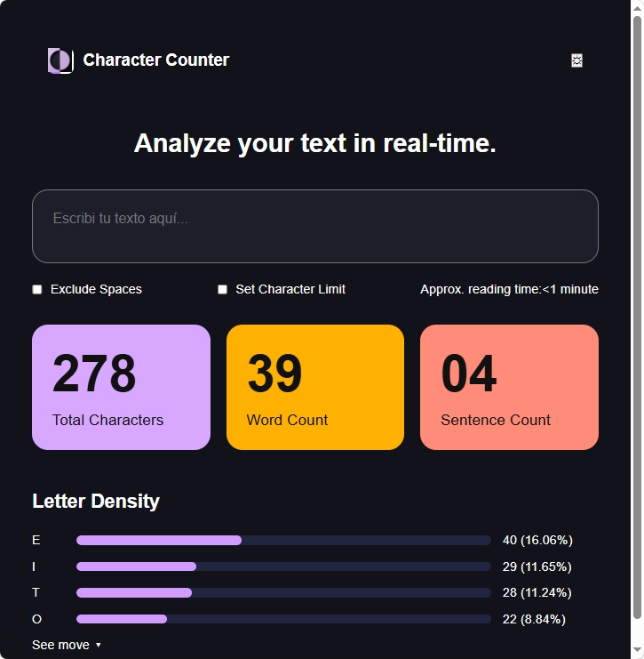

El objetivo de este proyecto es poner a prueba todo lo que vimos durante la cursada sobre html y css.

Para el proyecto se utilizó la IA como herramienta para la creación de las imágenes, salvo la captura de pantalla, como también para tener una referencia de cómo debería de quedar el orden de la estructura.

Para el html, se colocó en orden como en la referencia utilizando clases.

A partir de las clases, se fueron modificando los estilos.

Las dificultades encontradas fueron a la hora de crear el logo como también para encontrar la flecha de see more.

